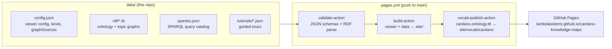

# Cardano Knowledge Maps

Interactive knowledge maps of the Cardano ecosystem — governance, smart contracts, and more.

**Live:** https://lambdasistemi.github.io/cardano-knowledge-maps/

## What is this

A browsable knowledge graph mapping the relationships between entities, processes, and concepts across the Cardano ecosystem: CIP-1694 governance, the Plutus smart-contract stack, the Conway transaction vocabulary, and the Cardano Budget 2026 proposals. Click any node to see its description and links to source documentation; use **Views** to focus on a specific topic.

This repository is **data-only**. It holds Turtle RDF graph sources, a SPARQL query catalog, and guided tours; it contains no application code. The viewer is provided by [graph-browser](https://github.com/lambdasistemi/graph-browser), and CI assembles the site from pinned graph-browser releases with zero build tools in this repo.

All instance data is grounded in a hand-authored OWL ontology built on standard W3C vocabularies (PROV-O, ORG, SKOS, OWL-Time, FOAF, Dublin Core), so the same triples can be queried by graph-browser, Protégé, Oxigraph, or any SPARQL endpoint.

## Architecture



The instance graph is split by topic; the runtime composes the 19 sources listed in `data/config.json::graphSources` (sources marked `"background": true` are always loaded and hidden from the viewer's Sources toggle list).

- `data/rdf/cardano.ontology.ttl` — Cardano domain ontology (OWL classes + object properties, W3C vocabularies); also published as a dereferenceable namespace document at [`/vocab/cardano`](https://lambdasistemi.github.io/cardano-knowledge-maps/vocab/cardano)
- `data/rdf/cardano.ttl` — shared cross-cutting instance nodes (Plutus, Conway era, ExUnits, ...) referenced by multiple focuses
- `data/rdf/transactions.ttl` — Conway transaction vocabulary, vendored from [cardano-ledger-rdf](https://github.com/lambdasistemi/cardano-ledger-rdf); pinned per [`data/rdf/PINNED.md`](data/rdf/PINNED.md)
- `data/rdf/governance.ttl` — CIP-1694 governance: actors, action types, processes, treasury, parameters
- `data/rdf/smart-contracts.ttl` — Plutus stack, languages, runtimes, dApps, Vasil features, Hydra L2
- `data/rdf/budget-2026/*.ttl` — one TTL per Cardano Budget 2026 proposal, plus shared `proposers.ttl`
- `data/config.json` — viewer configuration (kinds, colors, shapes, source labels)
- `data/queries.json` — SPARQL query catalog (35 queries; entries tagged `"view"` drive the Views menu)
- `data/tutorials/` — 19 guided tours listed in `data/tutorials/index.json`

## Quickstart

Browse the [live site](https://lambdasistemi.github.io/cardano-knowledge-maps/), or load the data through the hosted universal viewer:

```
https://lambdasistemi.github.io/graph-browser/?repo=lambdasistemi/cardano-knowledge-maps
```

To serve the site locally:

```sh
nix build                  # assembles viewer + data into ./result
npx serve result -p 10001  # or: just serve
```

## Usage

In the viewer:

- **Views** button — switch between topic-specific lenses
- **Click** a node to re-center and see its description
- **Hover** an edge to see why the relationship exists
- **Depth buttons** (1, 2, 3, All) control neighborhood size
- **Guided Tours** — narrative walkthroughs per view

The graph can also be queried outside the viewer: every `data/rdf/*.ttl` file is plain Turtle, parseable by any RDF toolchain.

## Documentation

- [`data/rdf/PINNED.md`](data/rdf/PINNED.md) — provenance and refresh procedure for the vendored transaction vocabulary
- [`.specify/memory/constitution.md`](.specify/memory/constitution.md) — the project's data-authoring principles (RDF-first, ontology alignment, semantic completeness)
- For AI agents, start at [AGENTS.md](AGENTS.md)

## Development

The dev shell provides Python with rdflib, `just`, `jq`, and the [EYE](https://github.com/eyereasoner/eye) reasoner:

```sh
nix develop
just validate   # parse every graphSources TTL via rdflib
just owl-smoke  # OWL 2 RL inference smoke fixtures via EYE
just build      # nix build of the deployable site
just ci         # build + validate + owl-smoke
```

CI runs the graph-browser `validate-action` (JSON schemas, RDF parsing, referential integrity) on every PR and publishes a static preview of the assembled site as a PR comment.

### Contributing

Edit the topic TTL whose subject your statements concern. If a node is genuinely shared between focuses (referenced as a subject from one and as a target from another, or both), promote it to `cardano.ttl`. Every node needs a `cardano:` type and every edge predicate a `cardano:` property definition in `cardano.ontology.ttl`. Edit `data/queries.json` for queries, `data/tutorials/` for tours.

## Disclaimer

Graph data was generated by AI based on publicly available Cardano documentation. Not formally reviewed or endorsed by any Cardano entity. Verify against [CIP-1694](https://cips.cardano.org/cip/CIP-1694) and [Cardano documentation](https://docs.cardano.org).
